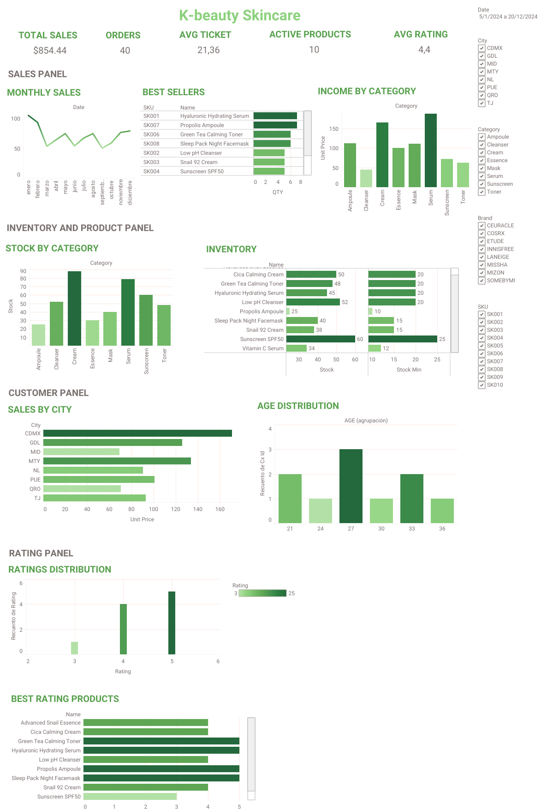
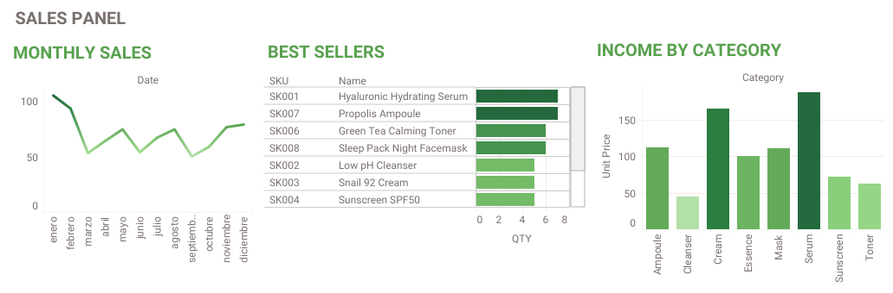
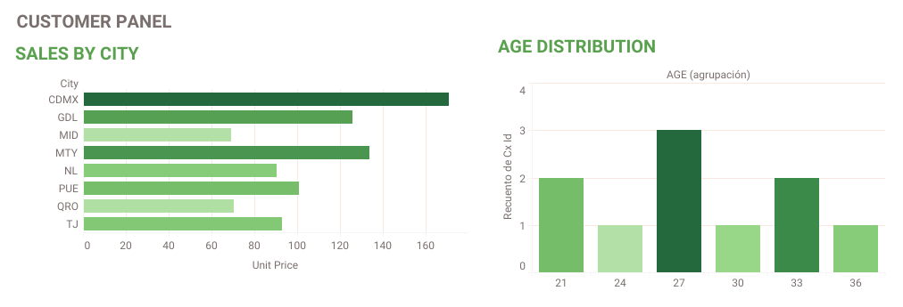
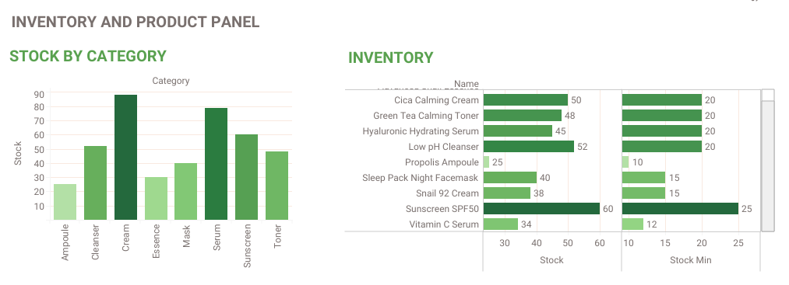
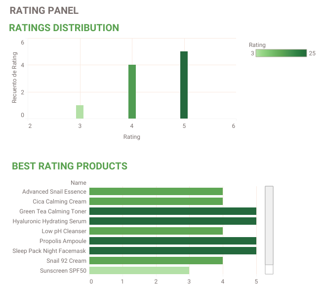

# K-Beauty Sales & Customer Analytics Dashboard

## Overview

This project focuses on business analytics and data visualization for a fictional K-Beauty retail company.

The objective was to analyze sales performance, customer behavior, inventory levels, product ratings, and operational KPIs through an interactive Tableau dashboard to support data-driven decision-making.

---

## Technologies

- Tableau
- Excel
- Data Visualization
- Business Analytics

---

## Business Questions Addressed

- Which products generate the highest sales?
- How do sales perform over time?
- What customer segments contribute the most revenue?
- Which products have the highest ratings?
- Are inventory levels sufficient to meet demand?
- What trends can support business growth?

---

## Key Performance Indicators (KPIs)

- Total Revenue
- Number of Orders
- Average Order Value
- Customer Distribution
- Product Ratings
- Inventory Levels
- Product Performance
- Monthly Sales Performance

---

## Dashboard Components

### Sales Analysis

- Revenue tracking
- Sales trends
- Best-selling products
- Monthly performance monitoring

### Customer Analytics

- Customer distribution
- Demographic insights
- Customer purchasing behavior

### Inventory Analytics

- Inventory monitoring
- Product availability
- Stock level analysis

### Product Performance

- Product ratings analysis
- Best-performing products
- Category comparison

---

## Dashboard Visualizations

The Tableau dashboard includes the following visualizations:

- Total Sales
- Orders
- Average Ticket
- Monthly Sales
- Best Sellers
- Sales by City
- Age Distribution
- Inventory Analysis
- Stock by Category
- Average Product Rating
- Best Rated Products
- Ratings Distribution
- Income by Category

---
## Dashboard Preview

### Executive Overview

This dashboard provides a high-level overview of business performance, including total sales, number of orders, average ticket value, active products, and average product ratings.

---

### Sales Analytics

This section analyzes monthly sales performance, best-selling products, and revenue distribution across product categories to identify growth opportunities and top-performing items.

---

### Customer Analytics

Customer insights are presented through geographic sales distribution and age segmentation, helping identify key customer groups and market opportunities.

---

### Inventory & Product Analytics

Inventory levels are monitored across product categories, allowing the identification of stock shortages, inventory risks, and product availability trends.

---

### Product Ratings Analysis

This section evaluates product ratings and highlights the highest-rated products, providing insights into customer satisfaction and product performance.

---

## Insights Generated

The dashboard provides a centralized view of business performance by integrating sales, customer, inventory, and product information into a single analytical platform.

The visualizations help identify sales trends, customer behavior patterns, inventory risks, and opportunities for business optimization.

---

## Skills Demonstrated

- Data Visualization
- Dashboard Development
- KPI Design
- Business Analytics
- Customer Analytics
- Sales Analytics
- Inventory Analytics
- Data Storytelling
- Tableau
- Excel

---

## Academic Context

Data Analytics and Visualization Project

Instituto Tecnológico de Hermosillo
